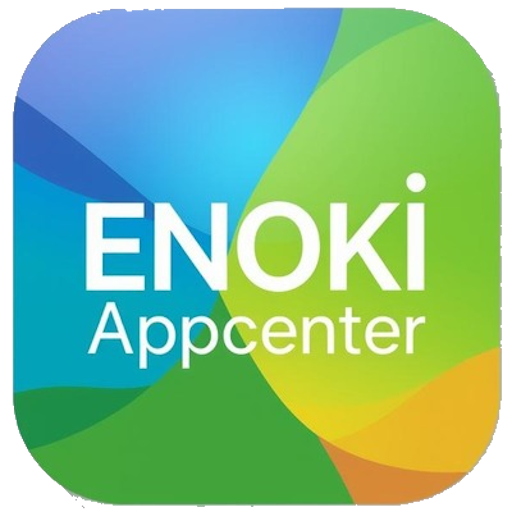

# ENOKI Appcenter

エノキ電気公式アプリ（ENOKI Appcenter）



## 概要

ときえのき（エノキ電気）が運営するソーシャルアプリです。  
友達追加・プロフィール管理・プッシュ通知などの機能を備えており、Nuxt 4 + TypeScript + Capacitor によって Web / Android / iOS に対応しています。

## アクセス

- 公式サイト: <https://app.enoki.xyz>

## 技術スタック

| カテゴリ       | 使用技術                                             |
| -------------- | ---------------------------------------------------- |
| フレームワーク | Nuxt 4 (SSR)                                         |
| 言語           | TypeScript                                           |
| UI ライブラリ  | Vuetify 3                                            |
| 状態管理       | Pinia + @pinia-plugin-persistedstate                 |
| テンプレート   | Pug                                                  |
| スタイル       | SCSS (sass-embedded)                                 |
| コンテンツ管理 | @nuxt/content                                        |
| 国際化         | @nuxtjs/i18n                                         |
| モバイル       | Capacitor 8 (Android / iOS)                          |
| フォント       | Google Fonts (Zen Maru Gothic)                       |
| バックエンド   | PHP + MySQL                                          |
| その他         | WebPush、QR コード読み取り・生成 (vue-qrcode-reader) |

## 主な機能・ページ構成

| パス              | 内容                   |
| ----------------- | ---------------------- |
| `/`               | トップページ           |
| `/login`          | ログイン               |
| `/registar`       | アカウント登録         |
| `/password_reset` | パスワードリセット     |
| `/user/[userId]`  | ユーザープロフィール   |
| `/friendlist`     | 友達リスト             |
| `/qrcode`         | QR コードで友達を探す  |
| `/settings`       | 設定（テーマ・通知等） |
| `/terms`          | 利用規約               |
| `/about`          | 運営情報               |
| `/tutorial`       | チュートリアル         |

## ファイル構成

```
jikantoki-appcenter/
├── app/                        # Nuxt アプリケーション本体（Nuxt 4 ディレクトリ）
│   ├── app.vue                 # ルートコンポーネント（スプラッシュ・テーマ制御）
│   ├── pages/                  # ページコンポーネント
│   │   ├── index.vue           # トップページ
│   │   ├── login.vue           # ログイン
│   │   ├── registar.vue        # アカウント登録
│   │   ├── password_reset.vue  # パスワードリセット
│   │   ├── friendlist.vue      # 友達リスト
│   │   ├── qrcode.vue          # QR コード
│   │   ├── terms.vue           # 利用規約
│   │   ├── about.vue           # 運営情報
│   │   ├── tutorial.vue        # チュートリアル
│   │   ├── settings/           # 設定ページ群
│   │   └── user/
│   │       └── [userId].vue    # ユーザープロフィール（動的ルーティング）
│   ├── components/
│   │   └── common/
│   │       └── commonSplash.vue  # スプラッシュ画面
│   ├── stores/                 # Pinia ストア
│   │   ├── app.ts              # アプリ全体の状態
│   │   ├── meta.ts             # メタ情報
│   │   ├── myProfile.ts        # 自分のプロフィール
│   │   └── settings.ts         # 設定（テーマ・言語等）
│   ├── js/                     # ユーティリティ関数
│   │   ├── Functions.ts        # 汎用関数
│   │   ├── ajaxFunctions.ts    # Ajax 通信
│   │   ├── metaFunctions.ts    # メタタグ操作
│   │   ├── muni.ts             # その他ユーティリティ
│   │   ├── setup.ts            # 初期化処理
│   │   └── webpush.ts          # WebPush 関連
│   └── mixins/
│       └── mixins.ts           # Vue ミックスイン
├── php/                        # PHP バックエンド（API サーバー用）
├── public/                     # 静的ファイル
├── capacitor.config.ts         # Capacitor 設定
├── nuxt.config.ts              # Nuxt 設定
├── content.config.ts           # @nuxt/content 設定
├── database.sql                # MySQL スキーマ
├── .env.example                # 環境変数サンプル
└── package.json
```

## 前提条件

- Node.js（LTS 推奨）
- yarn
- PHP + Composer（バックエンド API を使う場合）
- MySQL（バックエンド API を使う場合）

デプロイ先は Vercel を想定していますが、SSR 対応の環境であればどこでも動作します。

VSCode での開発を推奨します。

## セットアップ

### 1. リポジトリのクローンと依存パッケージのインストール

```shell
git clone git@github.com:jikantoki/jikantoki-appcenter.git
cd jikantoki-appcenter
yarn install
composer install  # PHP を使う場合
```

### 2. 環境変数の設定

`.env.example` をコピーして `.env` を作成し、各値を設定してください（クォーテーション不要）。

```env
NUXT_WEBPUSH_PUBLICKEY=パブリックキーをコピー
NUXT_WEBPUSH_PRIVATEKEY=プライベートキーをコピー

NUXT_API_ID=default
NUXT_API_TOKEN=後のPHPで作成するアクセストークン
NUXT_API_ACCESSKEY=後のPHPで作成するアクセスキー

NUXT_API_HOST=APIサーバーのホスト
```

Vercel 等にデプロイする場合は `Project Settings → Environment Variables` に同様の内容を設定してください。

#### WebPush 用の鍵の生成

<https://web-push-codelab.glitch.me/> で公開鍵・秘密鍵を生成できます。

### 3. PHP サーバー（内部処理用）

サーバーサイドは PHP で開発しているため、一部処理を実行するには PHP サーバーの用意が必要です。  
とりあえずレンタルサーバーでも借りれば実行できます。

1. API 用のドメインをクライアント側（Vercel 等）とは別で用意する
2. このリポジトリの `php` フォルダをドメインのルートにする（`.htaccess` 等で）
3. `nuxt.config.ts` の `runtimeConfig.public.apiHost` に API 用のドメインを設定する（または環境変数 `NUXT_API_HOST` で指定）
4. リポジトリルート直下に `/env.php` を用意し、以下の記述をする

```php
<?php
define('DIRECTORY_NAME', '/プロジェクトルートのディレクトリ名');

define('NUXT_WebPush_PublicKey', 'パブリックキー');
define('NUXT_WebPush_PrivateKey', 'プライベートキー');
define('WebPush_URL', 'プッシュ通知を使うドメイン');
define('WebPush_URL_dev', 'プッシュ通知を使うドメイン（開発用）'); // この行はなくても良い
define('WebPush_icon', 'プッシュ通知がスマホに届いたときに表示するアイコンURL');
define('Default_user_icon', 'アイコン未設定アカウント用の初期アイコンURL');

define('MySQL_Host', 'MySQLサーバー');
define('MySQL_DBName', 'DB名');
define('MySQL_User', 'DB操作ユーザー名');
define('MySQL_Password', 'DBパスワード');

define('SMTP_Name', '自動メール送信時の差出名');
define('SMTP_Username', 'SMTPユーザー名');
define('SMTP_Mailaddress', '送信に使うメールアドレス');
define('SMTP_Password', 'SMTPパスワード');
define('SMTP_Server', 'SMTPサーバー');
define('SMTP_Port', 587); // 基本は587を使えば大丈夫

$mailHeader = "<p>
いつも ENOKI Appcenter をご利用いただきありがとうございます。
<hr>
</p>";
$mailFooter = "<p>
<hr>
このメールに返信することはできません。
<br>
また、このメールに身に覚えのない場合は、エノキ電気までお問い合わせください。
<br>
<a href=\"https://app.enoki.xyz\">ENOKI Appcenter</a> by <a href=\"https://enoki.xyz\">エノキ電気</a>
</p>";
```

#### PHP サーバー用の .htaccess の設定例

```htaccess
<IfModule mod_rewrite.c>
RewriteEngine on
RewriteBase /
RewriteRule ^$ jikantoki-appcenter/php/ [L]
RewriteCond %{REQUEST_FILENAME} !-f
RewriteCond %{REQUEST_FILENAME} !-d
RewriteRule ^(.+)$ jikantoki-appcenter/php/$1 [L]
</IfModule>
Header append Access-Control-Allow-Origin: "*"
Header append Access-Control-Allow-Headers: "*"
```

### 4. MySQL の用意

#### /database.sql ファイルをインポートする

phpMyAdmin が使える環境なら DB 直下にインポートして終わりです。

### 5. デフォルト API トークンの用意

このプログラムは独自のアクセストークンを利用して API にアクセスします。  
そのため、初回 API を登録する作業が必要です。

1. セットアップした API 用サーバーの `/makeApiForAdmin.php` にアクセス
2. 初回アクセス時のみ MySQL で登録作業が行われるので、出てきた画面の内容をコピー
3. `.env` に内容を記述（書き方は上記参照）
4. 以後、その値を使って API を操作できます

**忘れたらリセット**するしかないので注意！（一部データは暗号化されており、管理者でも確認できません）

#### デフォルト API トークンのリセット方法

1. MySQL の `api_list` テーブルの `secretId='default'` を削除
2. `api_listForView` の `secretId='default'` も同様に削除
3. 初回登録と同じ手順でやる
4. データベースに再度 `default` が追加されていることを確認

## 開発サーバーの起動

```shell
yarn dev
```

開発サーバーは `http://localhost:10000` で起動します。

## ビルド

```shell
yarn build
```

## プレビュー（本番ビルド確認）

```shell
yarn preview
```

## 設定箇所

| 項目           | 設定箇所                               |
| -------------- | -------------------------------------- |
| アプリ名       | `package.json` / `capacitor.config.ts` |
| フォント       | `nuxt.config.ts` / `app/app.vue`       |
| テーマカラー   | `app/app.vue`                          |
| 環境変数       | `.env` / `nuxt.config.ts`              |
| Capacitor 設定 | `capacitor.config.ts`                  |

## 参考資料

- WebPush: <https://tech.excite.co.jp/entry/2021/06/30/104213>
- Nuxt: <https://nuxt.com/docs>
- Vuetify: <https://vuetifyjs.com>
- Capacitor: <https://capacitorjs.com>
